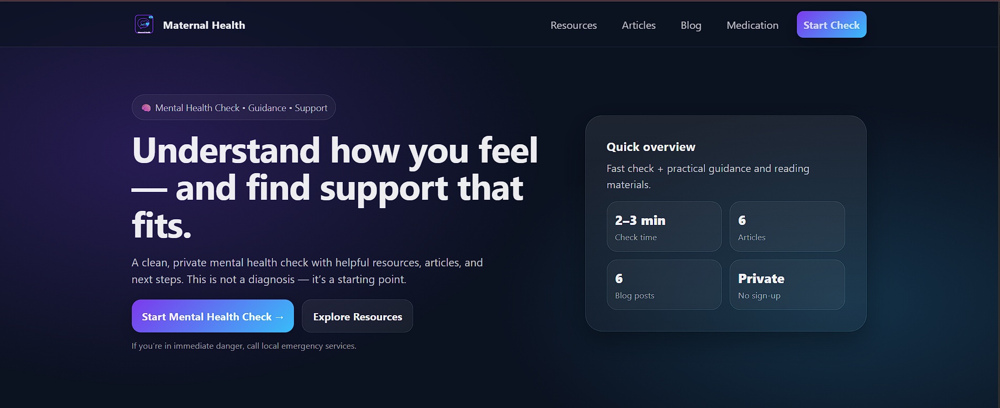
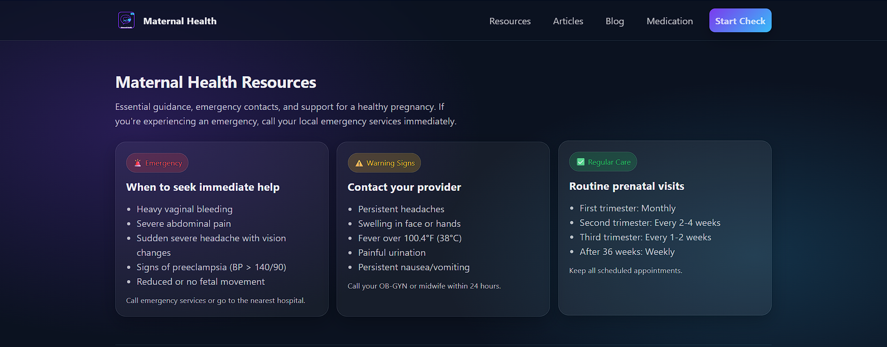
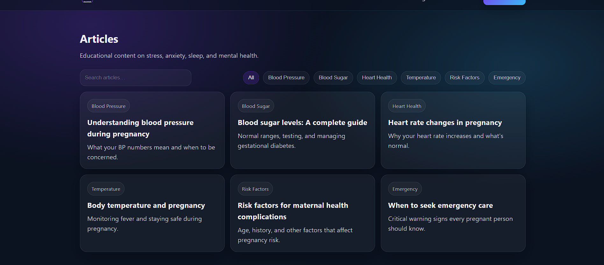
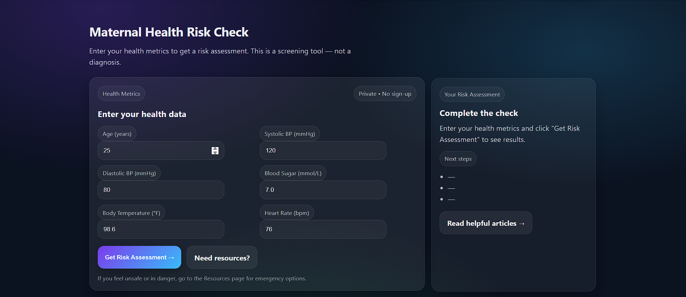

# Maternal Health Risk Prediction

<p align="center">
  
</p>
---
title: Maternal Risk Prediction API
sdk: docker
app_port: 7860
---

End-to-end ML + MLOps project to predict maternal health risk level (Low/Mid/High) from basic vital signs. Includes a full-featured web application for risk assessment, educational resources, and medication safety information.

## 🌟 Features

- **Risk Prediction**: Predict maternal health risk (Low/Mid/High) using vital signs
- **Web Application**: User-friendly interface for risk assessment
- **Data Validation**: Schema validation using Pydantic
- **Feature Engineering**: Automated feature building pipeline
- **Multiple Models**: Dummy, Logistic Regression, Random Forest, Extra Trees, MLP, XGBoost
- **Experiment Tracking**: MLflow integration for metrics, artifacts, and model versioning
- **Model Comparison**: Automated comparison across all models
- **REST API**: FastAPI-based inference endpoint

## 📊 Input Features

The model uses the following vital signs to predict risk:

| Feature | Description | Normal Range |
|---------|-------------|--------------|
| Age | Patient age in years | 18-45 |
| Systolic BP | Systolic blood pressure (mmHg) | 90-120 |
| Diastolic BP | Diastolic blood pressure (mmHg) | 60-80 |
| Blood Sugar | Blood glucose level (mmol/L) | 4.0-7.8 |
| Body Temperature | Temperature in °F | 97.0-99.0 |
| Heart Rate | Beats per minute | 60-100 |

## 📁 Project Structure

```
├── configs/              # YAML configuration files
│   └── train.yaml        # Training configuration
├── data/
│   ├── raw/              # Raw data
│   └── processed/        # Processed data
├── models/               # Saved model artifacts
├── mlflow/               # MLflow tracking data
├── notebooks/            # Jupyter notebooks for EDA
│   ├── 01_eda.ipynb
│   └── 02_model_comparison.ipynb
├── reports/              # Metrics and figures
│   └── figures/          # Confusion matrices, charts
├── src/maternal_risk/    # Source code
│   ├── api/              # FastAPI endpoints
│   ├── data/             # Data loading and validation
│   ├── evaluation/       # Metrics and plotting
│   ├── features/         # Feature engineering
│   └── models/           # Model registry and training
├── tests/                # Unit tests
└── webapp/               # Web application
    ├── main.py           # FastAPI app entry point
    ├── model.py          # Model loading utilities
    ├── schemas.py        # Pydantic request/response schemas
    ├── assets/           # Static assets (CSS, JS, images)
    └── *.html            # HTML templates
```

## 🚀 Quickstart

### 1. Setup Environment

```bash
python -m venv .venv

# Windows
.venv\Scripts\activate

# Linux/Mac
source .venv/bin/activate

pip install -e .
pip install -r requirements.txt
```

### 2. Run the Web Application

Start the FastAPI server:

```bash
uvicorn webapp.main:app --reload
```

Open your browser and navigate to: **http://127.0.0.1:8000**

The web application includes:
- **Home**: Overview and quick access to risk assessment
- **Check**: Enter vital signs and get instant risk prediction
- **Medication**: Pregnancy medication safety guide
- **Resources**: Educational materials and health guidelines
- **Blog/Articles**: Latest maternal health news and articles
- **Contact**: Get in touch for more information

### 3. API Usage

Make predictions via the REST API:

```bash
curl -X POST http://127.0.0.1:8000/api/predict \
  -H "Content-Type: application/json" \
  -d '{
    "Age": 30,
    "SystolicBP": 120,
    "DiastolicBP": 80,
    "BS": 6.5,
    "BodyTemp": 98.6,
    "HeartRate": 75
  }'
```

Response:
```json
{"risk_level": "Low"}
```

### 4. Train a Single Model

```bash
python -m maternal_risk.models.train --config configs/train.yaml --model logreg
python -m maternal_risk.models.train --config configs/train.yaml --model rf
python -m maternal_risk.models.train --config configs/train.yaml --model xgboost
```

Available models: `dummy`, `logreg`, `rf`, `extratrees`, `mlp`, `xgboost`

### 5. Compare All Models

```bash
python -m maternal_risk.models.compare --config configs/train.yaml
```

This will train all models and generate:
- `reports/model_comparison.csv`
- `reports/figures/model_f1_macro.png`
- Confusion matrices for each model

### 6. MLflow Tracking

Start the MLflow server:

```bash
mlflow server \
  --backend-store-uri sqlite:///mlflow/backend/mlflow.db \
  --default-artifact-root ./mlflow/artifacts \
  --host 127.0.0.1 \
  --port 5000
```

Then view experiments at: http://127.0.0.1:5000

### 7. Run Tests

```bash
pytest tests/
```

## 📈 Model Performance

| Model | F1 Macro | Accuracy |
|-------|----------|----------|
| Random Forest | 0.879 | 87.2% |
| XGBoost | 0.871 | 86.7% |
| Extra Trees | 0.864 | 85.7% |
| MLP | 0.710 | 70.4% |
| Logistic Regression | 0.595 | 60.1% |
| Dummy (baseline) | 0.190 | 39.9% |

> **Note**: The Random Forest model is used as the default for the web application.

## ⚙️ Configuration

Edit `configs/train.yaml` to customize:

```yaml
data:
  raw_path: data/raw/maternal_health.csv

train:
  test_size: 0.2
  random_state: 42

output:
  model_dir: models
  report_dir: reports
```

## � Docker Deployment

### Build and Run Locally

```bash
# Build the Docker image
docker build -t maternal-health-ai .

# Run the container
docker run -p 8000:8000 maternal-health-ai
```

Open http://localhost:8000 in your browser.

### Deploy to Render

1. Push your code to GitHub
2. Go to [Render Dashboard](https://dashboard.render.com/)
3. Click **New** → **Web Service**
4. Connect your GitHub repository
5. Render will auto-detect the `Dockerfile` and `render.yaml`
6. Click **Create Web Service**

Or use the Render Blueprint:
- Click **New** → **Blueprint**
- Select your repository
- Render will use `render.yaml` for configuration

### Environment Variables

| Variable | Default | Description |
|----------|---------|-------------|
| `PORT` | `8000` | Server port (set by Render automatically) |
| `MODEL_PATH` | `models/rf.joblib` | Path to trained model |

## �🛡️ Disclaimer

This tool is for educational purposes only and should not replace professional medical advice. Always consult with qualified healthcare providers for medical decisions.

## 📄 License

MIT
## Snapshot





